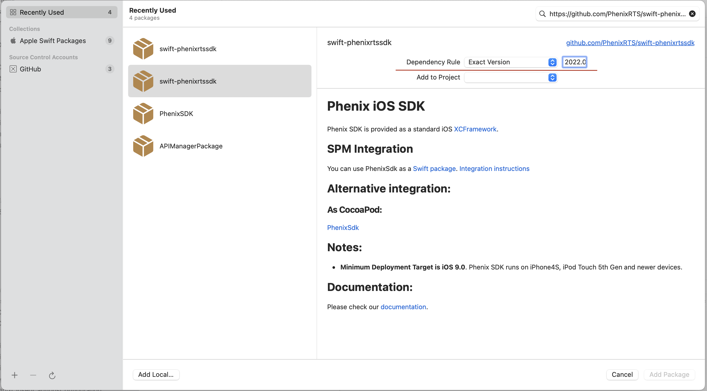

# Phenix iOS SDK

Phenix SDK is provided as a standard iOS [XCFramework](https://help.apple.com/xcode/mac/11.4/#/dev6f6ac218b).

## SPM Integration

You can use PhenixSdk as a [Swift package](https://github.com/PhenixRTS/swift-phenixrtssdk.git).

[Integration instructions](https://developer.apple.com/documentation/xcode/adding-package-dependencies-to-your-app)

Choose an "Exact Version" of the Phenix SDK in SPM Dependency Rule.

Example:

  

The SDK version can be found as a tag of this repository.

## Alternative integration:

### As CocoaPod:

[PhenixSdk](https://github.com/PhenixRTS/CocoaPodsSpecs)

## Notes:
* **Minimum Deployment Target is iOS 9.0**. Phenix SDK runs on iPhone4S, iPod Touch 5th Gen and newer devices.

## Documentation:

Please check our [documentation](https://phenixrts.com/docs/ios/).
